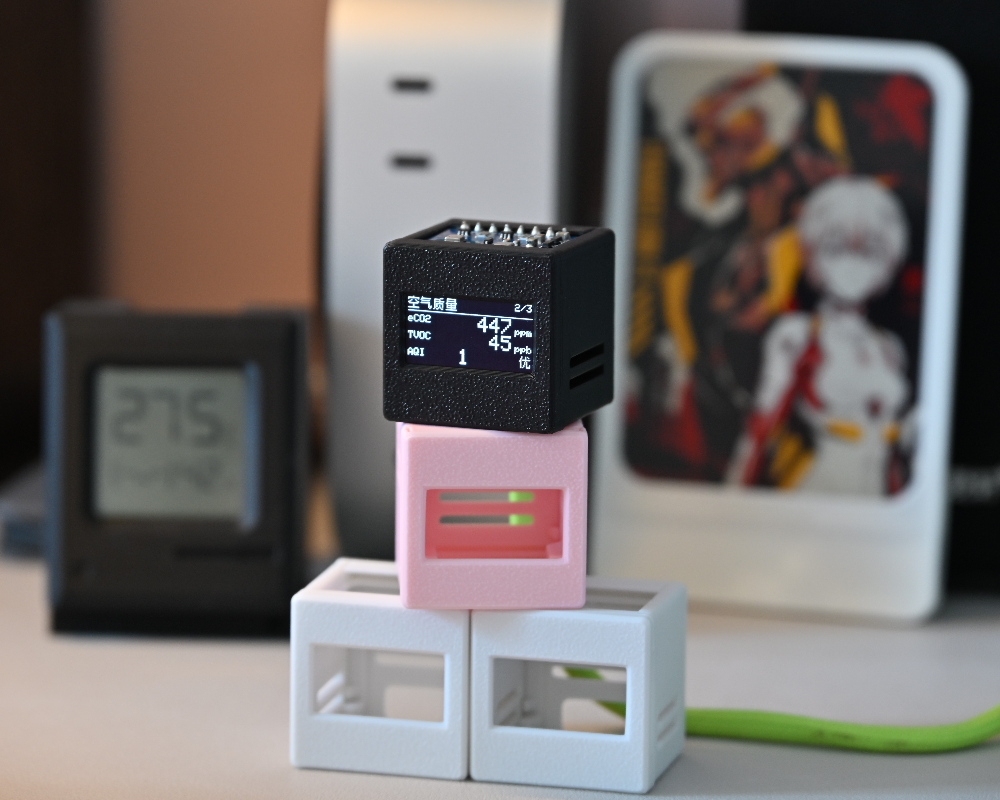

# 室内空气质量监测仪（ESP32-C3 + ENS160 + AHT30 + OLED）

采用 ESP32-C3 Mini 的室内空气质量实时监测仪，通过 ENS160 空气质量传感器与 AHT30 温湿度传感器采集数据，在 0.96 寸 SSD1306/SSD1315 OLED（128×64）上分页显示，并提供基于 ESPHome 的 Home Assistant 接入方案。



## 监测指标

| 指标   | 说明            | 单位  |
| ---- | ------------- | --- |
| AQI  | 空气质量指数（1–5 级） | 级   |
| eCO₂ | 等效二氧化碳        | ppm |
| TVOC | 总挥发性有机物       | ppb |
| 温度   | AHT30，经分段偏移校准 | °C  |
| 相对湿度 | AHT30，经分段偏移校准 | %RH |

## 硬件清单

| 组件                           | 说明                                         | 参考价   |
| ---------------------------- | ------------------------------------------ | ----- |
| ESP32-C3 Mini 开发板            | 主控，Wi-Fi + BLE                             | \~¥13 |
| ENS160 空气质量 + AHT30 温湿度传感器模块 | I²C，输出 AQI / TVOC / eCO₂                   | \~¥26 |
| SSD1306/SSD1315 OLED         | 0.96 寸，128×64，I²C，地址 0x3C（本固件默认，常见还有 0x3D） | \~¥10 |

### 接线

所有设备共用 I²C 总线（SDA=GPIO8，SCL=GPIO9），供电 **必须 3.3V**（5V 会烧毁传感器）：

```
ESP32-C3 Mini          ENS160      AHT30       OLED
   3.3V  ────────────── VIN ────── VIN ────── VCC
   GND   ────────────── GND ────── GND ────── GND
   GPIO8 ────────────── SDA ────── SDA ────── SDA
   GPIO9 ────────────── SCL ────── SCL ────── SCL
```

## 目录结构

```
co2/
├── platformio.ini        # PlatformIO 工程配置（主固件）
├── src/
│   ├── main.cpp          # 主程序：传感器读取、温湿度校准、分页调度
│   ├── ui_pages.cpp      # 各页面绘制逻辑（硬件无关，仅依赖 Canvas 抽象）
│   ├── canvas_oled.cpp/h # Canvas 接口的 OLED 实现（Adafruit_SSD1306）
├── include/
│   ├── ui_layout.h       # 屏幕布局常量
│   ├── ui_canvas.h       # 抽象 Canvas 接口
│   └── ui_pages.h        # 页面声明与数据结构
├── tools/                # PC 端 UI 模拟器（ASCII 预览）与布局校验脚本
├── esphome/              # ESPHome 固件方案（接入 Home Assistant），见 esphome/README.md
└── docs/
    ├── plan.md               # 项目完整实现方案与排障手册
    ├── plan_ui_sim.md        # UI 抽离 + 模拟渲染器设计说明
    └── sensor-specs-scan-AHT21-ENS160.pdf  # 传感器模块规格扫描件（购买时附）
```

## 固件方案

项目提供两套固件：

1. **Arduino/PlatformIO 固件**（根目录）——本地分页显示，无需联网
2. **ESPHome 固件**（`esphome/`）——接入 Home Assistant，编译烧录步骤详见 [esphome/README.md](esphome/README.md)

### 编译与烧录（PlatformIO）

```bash
# 编译
pio run

# 烧录（COM5 换成实际串口号）
pio run -t upload --upload-port COM5

# 查看串口日志
pio device monitor
```

依赖库由 `platformio.ini` 自动拉取：SparkFun ENS160（v1.1.0）、Adafruit GFX、Adafruit SSD1306。

### 界面

3 个页面自动轮播（每页 8 秒）：温湿度 → CO₂ + TVOC → 动画表情。

UI 代码与硬件解耦：页面绘制只依赖抽象 `Canvas` 接口，同一份 UI 代码既能驱动 OLED，也能在 PC 上以 ASCII 字符预览（`tools/` 下的 `ui_sim` 模拟器，可用 `Makefile` 或 `build_sim.bat` 编译）。

## ENS160 校准与温湿度补偿

- **预热**：初次上电需连续通电约 1 小时进行初始校准；连续通电 24 小时后校准数据写入传感器内部存储，之后每次启动约 3 分钟就绪。
- **温湿度补偿**：eCO₂/TVOC 测量依赖 AHT30 的温湿度数据进行补偿，每次读取前必须写入。
- **显示校准**：ENS160 加热板会使 AHT30 测得的温度偏高、湿度偏低。`src/main.cpp` 采用"双轨 + 分段偏移"策略——原始值直接喂给 ENS160 补偿，显示值按区间查偏移表修正。

## 常见问题

| 问题                       | 解决方法                                              |
| ------------------------ | ------------------------------------------------- |
| OLED 不显示                 | 检查 I²C 地址（常见 0x3C / 0x3D）与接线                      |
| 编译报错 `Wire1`             | 已通过 main.cpp 首行 `#define SOC_HP_I2C_NUM 2` 解决     |
| 温度偏高 / 湿度偏低              | ENS160 热板烘烤 AHT30，根据实际值调整偏移量                      |
| ENS160 无数据               | 检查 RESET→IDLE→CLEAR→STANDARD 初始化序列                |
| 刚上电读数不准 / eCO₂ 恒为 400ppm | 正常现象：ENS160 每次启动需约 3 分钟预热；全新传感器首次需连续通电 \~1 小时初始校准 |

## 开源协议

本项目采用 [GPL-3.0](LICENSE) 协议开源（Copyright © 2026 EndTheme）。

- ✅ 允许任何个人或商业用途使用、修改、分发本项目
- ⚠️ 分发（含商用）时**必须保留原作者版权声明**
- ⚠️ 基于本项目修改后的固件/源码**必须以 GPL-3.0 协议完整开源**
- 本项目不提供任何担保，详见协议原文

